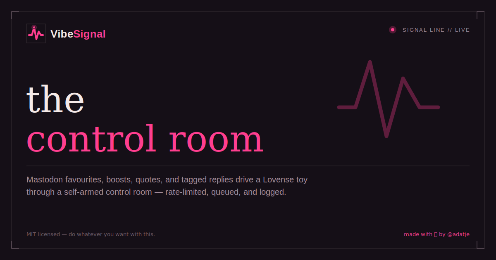
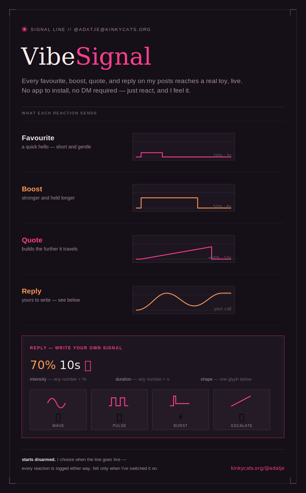

<p align="center">
  
</p>

<h1 align="center">VibeSignal</h1>

<p align="center">
  
</p>

Controls a Lovense toy (via [buttplug.io](https://buttplug.io)) from Mastodon interactions on
your own posts: favourites, boosts, quote posts, and replies (which can carry custom intensity,
duration, and pattern commands). Bundles the buttplug server (`intiface-engine`) itself — it's
downloaded automatically on first run, no separate Intiface Central install needed. Includes a
local web dashboard — **the control room** — for arming, firing test signals, and watching it
all happen live.

## Overview

<p align="center">
  
</p>

- **Mastodon-driven playback.** Favourites, boosts, and quote posts each map to their own
  configurable intensity/duration/pattern; replies are freeform (`"🌊 70% 12s"`) and get parsed.
- **Armed/disarmed by design.** Nothing reaches the toy until you flip the dashboard's arm
  switch — everything else (including a panic-stop) still logs, it just doesn't fire.
- **Rate limiting.** A configurable cooldown (an action's own duration plus a buffer you set
  from the dashboard) stops triggers from stacking faster than the toy can keep up.
- **Live queue view.** See what's currently playing and what's queued behind it, and who (or
  what event) triggered each one.
- **Toy connection status + rescan.** The dashboard shows which device is paired and whether
  it's currently connected, with a button to re-scan for devices without restarting the app.
- **Scoping.** React to every post, or lock onto a single specific post.
- **History &amp; leaderboard.** Every interaction (delivered or not, e.g. while disarmed or
  rate-limited) is logged to SQLite, with a leaderboard of who's fired the most.

## Setup

1. **Create a Mastodon access token.** On your instance, go to
   `Preferences -> Development -> New Application`, give it any name, and leave the scope at
   (at least) `read`. Create it, then copy the access token shown.

2. **Install dependencies:**
   ```sh
   python3 -m venv .venv
   source .venv/bin/activate
   pip install -r requirements.txt
   ```

3. **Configure:**
   ```sh
   cp config.example.yaml config.yaml
   ```
   Edit `config.yaml`: set `mastodon_api_base_url` and `mastodon_access_token`. Adjust the
   `favourite_action` / `reblog_action` / `quote_action` intensities and durations, and the
   `max_intensity` / `max_duration_s` safety ceiling, to taste.

4. **macOS only — grant Bluetooth permission to your terminal app first.** The bundled
   `intiface-engine` binary isn't code-signed, so macOS won't show its usual "wants to use
   Bluetooth" prompt — it just crashes on startup instead. Before running the app, go to
   **System Settings -> Privacy & Security -> Bluetooth**, click **+**, and add whatever terminal
   app you're running this from (Terminal, iTerm2, etc). If you skip this, `python -m
   vibe_app.main` will fail fast with an error telling you to do exactly this.

5. **Run:**
   ```sh
   python -m vibe_app.main
   ```
   The first run downloads `intiface-engine` into `vibe_app/bin/`. Once you see
   `[toy] scanning for devices` in the log, **turn your Lovense toy on and put it in
   pairing/Bluetooth mode** — that's the window in which it'll be discovered and grabbed
   (`scan_timeout_s` in config, default 15s). If nothing is found, just restart the app with the
   toy already on.

6. **Open the dashboard** at `http://127.0.0.1:8420` — see [The dashboard](#the-dashboard) below.

## How reactions map to the toy

| Event | Behavior |
|---|---|
| Favourite | small fixed buzz (`favourite_action` in config) |
| Boost (reblog) | bigger/longer fixed buzz (`reblog_action`) |
| Quote post | its own bigger tier, ramps up (`quote_action`) |
| Reply | custom — see below |

Replies are parsed for:
- **Intensity**: a number followed by `%`, e.g. `70%`
- **Duration**: a number followed by `s`/`sec`/`seconds`, e.g. `10s`
- **Pattern emoji** (first match wins): 🌊 wave · 💓/💗/💕 pulse · ⚡ burst · 🔥 escalate

So a reply like `"🌊 70% 12s"` plays a 12-second wave pattern peaking at 70% intensity. Anything
not specified falls back to `reply_default_intensity`/`reply_default_duration_s` in config, and
everything is clamped to `max_intensity`/`max_duration_s` regardless of what the reply asked for.

Plain `@mentions` that aren't actually replies to one of your posts are logged but don't trigger
anything.

## The dashboard

Open `http://127.0.0.1:8420` — the app starts **disarmed**, so nothing reaches the toy until you
arm it here.

- **Arm / disarm** — the master switch. While disarmed, everything still gets logged, just never
  sent to the toy.
- **Panic stop** — immediately halts the toy and clears anything queued.
- **Toy status** — shows which device is paired and whether it's currently connected, with a
  **Rescan** button to look for devices again without restarting the app (useful if the toy
  wasn't on yet, or dropped connection).
- **Cooldown buffer** — the rate limit: how many extra seconds (on top of an action's own
  duration) must pass before the next trigger is accepted. Editable live; persists across
  restarts.
- **Manual trigger** — fire a favourite/boost/quote-tier signal yourself, or a custom
  intensity/duration/pattern (or reply-style text like `"70% 10s 🌊"`).
- **Mode** — react to all posts, or scope to one specific post (pick from your recent posts, or
  paste a URL).
- **Queue** — what's playing right now and what's queued behind it, with who (or what event)
  triggered each one.
- **Top controllers** — a leaderboard of who's fired the toy the most.
- **History** — the last 20 interactions, including ones that didn't fire (disarmed, rate
  limited, or over the queue cap), each showing intensity/duration/pattern and a link back to
  the triggering post where applicable.

## Notes

- Everyone's interactions count — there's no allowlist by design (per your setup choice). The
  armed toggle and panic-stop button are your manual safety controls; the per-action safety
  ceiling in config is a hard limit on *how much*, applied regardless of *who*.
- `max_queued_seconds` caps how much total buzz time can be queued at once, so a post that goes
  unexpectedly viral can't queue an unbounded backlog — anything beyond the cap is still recorded
  in the dashboard history, just not sent to the toy.
- The rate-limit cooldown buffer seeds from `rate_limit_buffer_s` in config on first run only —
  after that, whatever you last set on the dashboard is what persists across restarts.
- History (including things that happened while disarmed) lives in `history.sqlite3`, gitignored
  alongside `config.yaml` (which holds your access token) and the downloaded engine binary.
